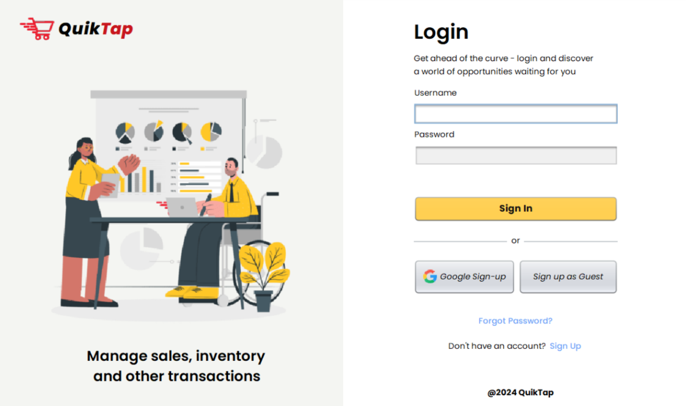
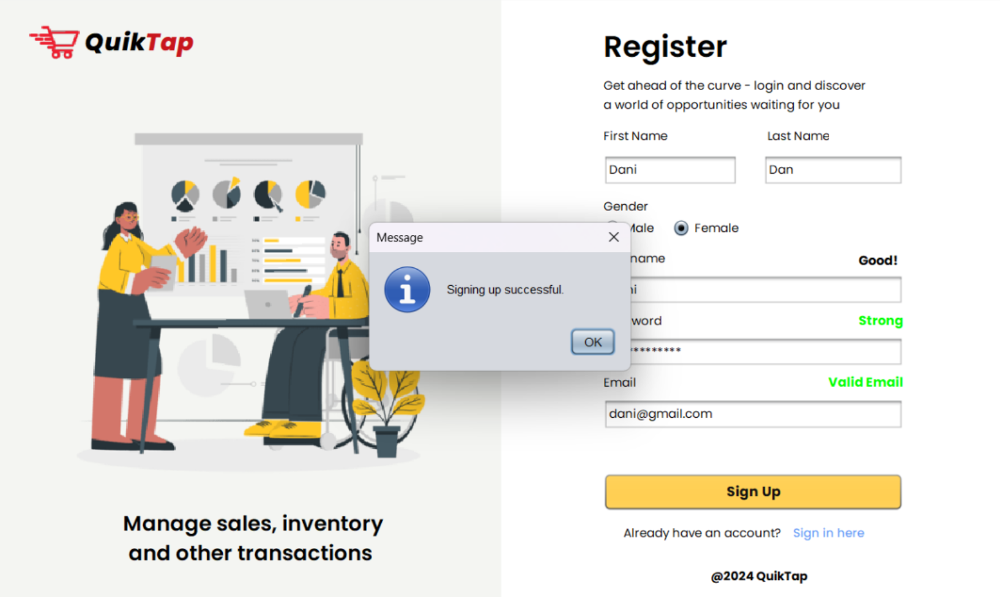
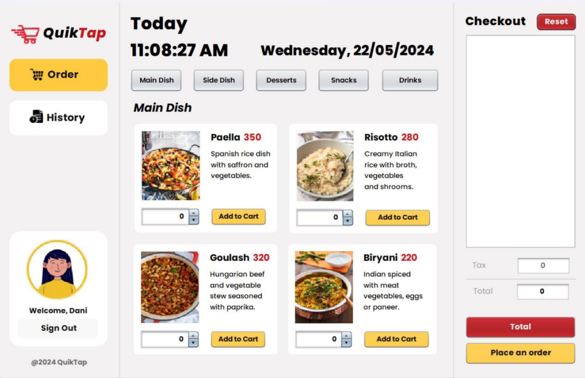
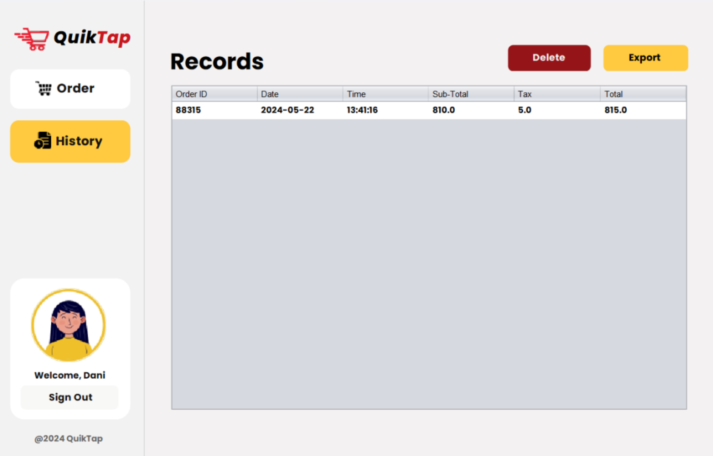

<div align="center">

# QuikTap

### *Fast, secure, and modern Point of Sale for businesses*

<p>
   <a href="https://github.com/danielnoelle/QuikTap">
      
   </a>
   <a href="LICENSE">
      
   </a>
   <a href="https://www.instagram.com/_noweliih/">
      
   </a>
</p>



</div>

---

## ✨ Features

<table>
<tr>
<td width="50%">

**🎯 Unified POS Toolkit**  
Sales, inventory, user management, and analytics in one comprehensive application

**🔐 Secure Authentication**  
Staff and admin login with robust session management

</td>
<td width="50%">

**📈 Live Reporting**  
Real-time analytics and exportable records at your fingertips

**🎨 Modern UI**  
Clean, intuitive Java Swing interface designed for efficiency

</td>
</tr>
</table>

---

## 🚀 Quick Start

**Clone and Build**

```bash
git clone https://github.com/danielnoelle/pulse.linux.git
cd "QuikTap - A POS System (DONE)"
mvn clean package
```

**Run Application**

```bash
java -cp target/classes com.mycompany.posproject.pos
```

---

## 💡 Configuration Tips

| Feature | Description |
|---------|-------------|
| **🗄️ Database** | Configure your MySQL settings in `javasave.java` before first run |
| **📤 Export** | Use the built-in export feature to save sales history as Excel files |
| **👥 User Roles** | Assign permissions for staff and admins in the user management panel |
| **⌨️ Navigation** | Keyboard shortcuts available for faster operation |
| **🐛 Debug** | Enable debug mode in settings for detailed logs |

---

## 📋 Core Capabilities

### Fast Sales Processing

Process transactions in seconds with barcode scanning, automatic calculations, and instant receipt generation.

```
✓ Item added to cart
✓ Discount applied
✓ Payment processed
✓ Receipt printed
```

### Smart Inventory Management

Maintain complete control over your stock with real-time updates and intelligent alerts.

```
✓ Add/Edit/Delete products
✓ Low stock alerts
✓ Import/export inventory data
✓ Batch updates supported
```


### User & Session Management

Secure your business with role-based access control and session monitoring.

```
✓ Secure login/logout
✓ Role-based permissions
✓ Session timeout for security
✓ Activity logging
```

---

## 🖼️ Screenshots

<div align="center">
<table>
<tr>
<td width="50%">

<p align="center"><em>Secure Login Interface</em></p>
</td>
<td width="50%">

<p align="center"><em>Sales Processing Dashboard</em></p>
</td>
</tr>
<tr>
<td width="50%">

<p align="center"><em>Records & Analytics Panel</em></p>
</td>
<td width="50%">

<p align="center"><em>Inventory Management</em></p>
</td>
</tr>
</table>
</div>

<br>

## 🛠️ Technology Stack

- **Language:** Java
- **UI Framework:** Java Swing
- **Database:** MySQL
- **Build Tool:** Maven
- **Architecture:** MVC Pattern


## 📝 License

This project is licensed under the **MIT License** — feel free to use, modify, and contribute.  
See [LICENSE](LICENSE) for full details.

---

<div align="center">

**Built with ❤️ by [danii](https://github.com/danielnoelle)**

⭐ Star this repository if you find it helpful!

</div>
